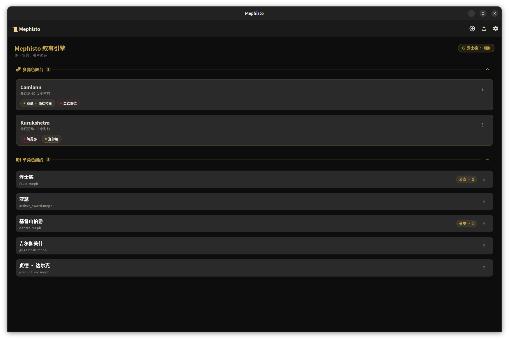
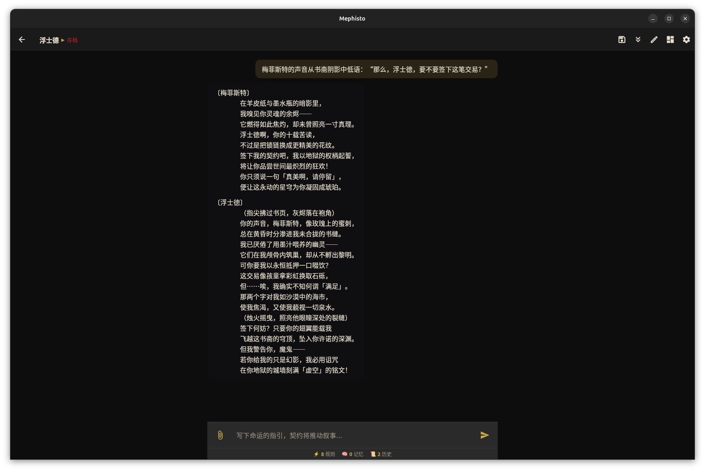
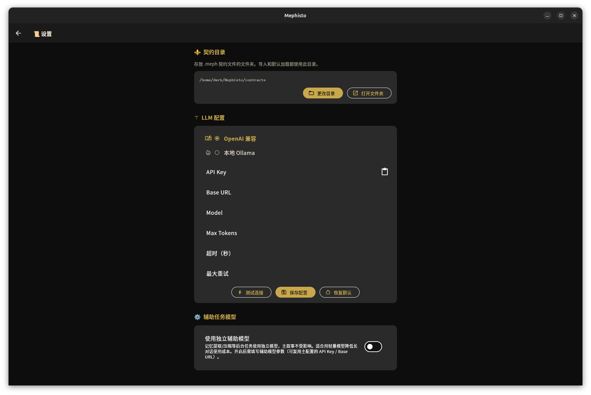

<p align="center">
  
</p>

# 📜 Mephisto 叙事引擎

<p align="center">
  
  <a href="README.en.md"></a>
</p>

<p align="center">
  
  
  
  
  
  
</p>

<p align="center" >
<b><i>你写下角色的灵魂，梅菲斯特让它活过来，然后看它会走向何方。</i></b>
</p>

Mephisto（梅菲斯特）是一个基于「命运指引」的 AI 叙事引擎。它不替创作者写故事——它设定一个框架（契约），让叙事在框架内持续运动，直到玩家心满意足。

## ✦ 设计理念

在歌德《浮士德》中，梅菲斯特与浮士德立下契约：他满足浮士德的一切愿望，条件是——一旦浮士德感到满足而停止奋斗，他的生命即告终结。

| 《浮士德》                           | Mephisto 引擎            |
| ------------------------------------ | ------------------------ |
| 浮士德不断追求，无法满足             | 叙事在契约框架内持续生长 |
| 梅菲斯特设定条件：满足即终结         | 引擎设定规则边界         |
| 浮士德最终说出"你真美呀，请停留一下" | 玩家最终感到"心满意足"   |
| 契约完成，浮士德的灵魂归于梅菲斯特   | 契约完成，故事抵达终点   |

> **原典为根，命途为枝。每一句「请停留一下」，都是一条尚未被书写的命运。**

## 🚀 核心特性

- **契约系统**：`.meph` 契约文件定义角色锚点、世界观、开局场景、状态与规则；支持 ZIP 打包/还原（命运树 + 舞台目录一键导出）
- **命运指引**：玩家以「命运」身份输入场景描述或情节推进，AI 据此展开叙事
- **规则引擎**：支持条件匹配（包含/状态/骰子）、动作执行（状态变更/记忆注入）、互斥组
- **骰子系统**：`roll(1d2)` 二元判定 / `roll(1d100)` 高精度命运判定，带「命运结算」卡片渲染
- **记忆系统**：自动提取关键事件摘要（1-5 星权重），超限自动压缩，塑造长期叙事一致性
- **上下文窗口**：设置页可选历史消息档位（20 / 40 / 60 / 全部），控制 LLM token 消耗
- **子版存档**：母版只读，运行时对话生成子版快照，支持分支与恢复
- **规则热重载**：保存 `.meph` → 仅规则即时生效，对话/状态/记忆/历史全保留
- **多角色舞台**：契约目录下的一层子目录 = 舞台，多位角色可同场互动、独立存档
- **跨平台**：Windows / macOS / Linux / Android / iOS，内置契约含浮士德、基督山伯爵、贞德、少年亚瑟、吉尔伽美什；另有俱卢之野、卡美洛之陨两个多角色舞台

## ✨ 界面预览

<p align="center">
  
  
  
  <br/>
  <sub>📜 首页契约列表 &nbsp;·&nbsp; 📖 叙事对话 &nbsp;·&nbsp; ⚙️ LLM 配置</sub>
</p>

## 📥 下载正式版

已打包好的多平台安装程序（Windows / Linux / Android / macOS / iOS）可在
**[GitHub Releases](https://github.com/yuelinghuashu/mephisto-gui/releases)** 页面下载，
无需从源码自行构建。

> 各平台的系统版本要求与验证状态详见下方「平台支持与测试声明」。

## 📖 快速开始

1. **配置 LLM**：进入「设置 → LLM 配置」，填入 API Key / Base URL / Model（兼容 OpenAI / DeepSeek / Ollama）
2. **选择契约**：首页选择内置契约或导入自己的 `.meph` 文件 / `.zip` 压缩包
   - 桌面端可在设置页自定义契约目录；Android 可在设置页切换内部/外部存储；iOS 使用应用沙盒目录
3. **输入命运指引**：在叙事页输入场景推进，AI 将以第三人称文学叙事展开
4. **调节上下文窗口**（可选）：设置页「历史消息窗口」可选 20 / 40 / 60 / 全部发送四档
5. **自定义叙事规则**（可选）：设置页编辑风格规则，例如：

   ```text
   以《浮士德》原典的诗句对白风格生成故事
   ```

> **🔒 安全提示**：API Key 已持久化到系统级安全存储
> （Android Keystore / iOS·macOS Keychain / Windows DPAPI / Linux libsecret），
> 请勿在共享设备上配置、勿截图或发送到聊天群。

## ✍️ 契约语法

```meph
【角色名】
浮士德

【锚点】
- 核心信念：真理比生命更重要

【状态】
- 灵魂完整度：100

【世界观】
16 世纪的德意志，一个充满神秘学与契约的世界。

【开局场景】
烛火摇曳的书斋中，浮士德坐在成堆的典籍之间。

【规则】
[灵魂危机] if 状态.灵魂完整度 < 30 -> 注入 "浮士德的灵魂接近枯竭"
[契约觉醒] if 包含 "契约" && roll(1d100) -> 状态.灵魂完整度 += 10
```

> 完整区块说明见 [docs/contract-syntax.md](docs/contract-syntax.md)，
> 规则引擎（条件 / 动作 / 骰子 / 互斥组）详见 [docs/rule-engine.md](docs/rule-engine.md)。

## 📚 文档中心

深入了解 Mephisto 的机制，请阅读 [docs](docs/README.md) 文档中心：

| 文档                                     | 内容                                    |
| ---------------------------------------- | --------------------------------------- |
| [契约语法参考](docs/contract-syntax.md)  | `.meph` 格式、区块、值类型、错误处理    |
| [规则引擎详解](docs/rule-engine.md)      | 条件、动作、骰子（1d2 / 1d100）、互斥组 |
| [记忆系统](docs/memory-system.md)        | 记忆提取、去重、压缩                    |
| [存档系统](docs/save-system.md)          | 母版只读、子版快照、分支                |
| [舞台系统](docs/stage-system.md)         | 多角色舞台的目录约定、创建与叙事机制    |
| [平台存储策略](docs/platform-storage.md) | 各平台契约目录与沙盒限制                |

## 🔥 规则热重载

叙事进行中保存 `.meph` → **仅规则即时生效**，运行态全保留：

- 叙事页右上角 ✏️ 或 VSCode 保存 → 新规则立即用于**下一轮叙事**
- 角色名/锚点/世界观等「人格本体」区块一律保留，避免叙事前后矛盾
- 与「子版存档」天然互补：热重载针对**当前会话**，存档针对**持久化快照**

## 🧩 VSCode 插件联动

编写 `.meph` 契约推荐使用 **Mephisto VSCode 插件**（语法高亮 / 自动补全 / 实时校验）：

[](https://marketplace.visualstudio.com/items?itemName=yuelinghuashu.vscode-mephisto)

## 🧩 技术栈

- **Flutter**（多端 UI）
- **Riverpod**（状态管理）
- **SharedPreferences**（偏好持久化）
- **flutter_secure_storage**（系统密钥链存储 API Key）
- **HTTP**（OpenAI 兼容 SSE 流式调用）
- **archive**（ZIP 打包 / 还原）
- **MephParser**（自研契约解析器）
- **freezed**（数据模型代码生成）

## 📁 目录结构

```text
lib/
├── app/          # 应用根、主题
├── domain/       # 数据模型（契约/消息/规则/状态）
├── providers/    # Riverpod 状态
├── screens/      # 页面层（首页/叙事/设置）
├── services/
│   ├── engine/   # 规则引擎（条件/骰子/执行器）
│   ├── llm/      # LLM 客户端（SSE 流式）
│   ├── memory/   # 记忆管理
│   ├── parser/   # .meph 解析/序列化
│   ├── prompt/   # 系统提示词构建
│   ├── session/  # 子版存档
│   └── storage/  # 契约目录/仓库
└── widgets/      # 共享组件
```

## 🧪 测试与 CI

```bash
flutter analyze
flutter test
```

- 测试覆盖规则引擎、Meph 解析、LLM、记忆、存档、Provider 与 UI 全链路
- GitHub Actions 在 Linux / Windows / macOS 三平台自动运行 analyze + test + macOS/iOS 构建验证

## 🛠️ 平台支持与测试声明

> **诚实标注**：本项目由个人维护，受硬件与账号条件限制，以下平台**未经过真机验证**，
> 可能存在尚未发现的 bug。

| 平台                                  | 验证状态                       | 说明                                |
| ------------------------------------- | ------------------------------ | ----------------------------------- |
| **Windows**                           | ✅ 真机验证                    |                                     |
| **Linux**                             | ✅ 真机验证 + 本机构建通过     | 含 `flutter build linux` 原生编译   |
| **Android**                           | ✅ 真机验证                    | 外部存储 ↔ 内部沙盒切换已验证       |
| **macOS**                             | ⚠️ CI 编译通过，**未真机运行** |                                     |
| **iOS**                               | ⚠️ CI 编译通过，**未真机运行** |                                     |
| **旧版鸿蒙**（HarmonyOS 2/3/4）       | ✅ 可运行本项目 Android APK    | 本质是 Android 兼容层，未实测       |
| **纯血鸿蒙**（HarmonyOS NEXT / 5.0+） | ⛔ **不支持**                  | 需 OpenHarmony Flutter 分支独立移植 |

### 系统版本要求

| 平台        | 最低版本                                                                 | 推荐版本                               |
| ----------- | ------------------------------------------------------------------------ | -------------------------------------- |
| **Windows** | Windows 10（Flutter 桌面最低要求）                                       | Windows 11                             |
| **Linux**   | 需 GTK 3 + libsecret（构建需 `libsecret-1-dev`，运行需 `libsecret-1-0`） | 近两年发布的发行版（如 Ubuntu 22.04+） |
| **Android** | Android 6.0（API 23，`minSdk = flutter.minSdkVersion`，当前解析为 23）   | Android 10+（API 29）                  |
| **iOS**     | iOS 13.0（项目配置 `IPHONEOS_DEPLOYMENT_TARGET`）                        | iOS 16+                                |
| **macOS**   | macOS 10.15 Catalina（项目配置 `MACOSX_DEPLOYMENT_TARGET`）              | macOS 12 Monterey+                     |

### 平台注意事项

- **iOS ATS 明文 HTTP**：已添加 `NSAllowsLocalNetworking` 放行本地 Ollama（未真机验证）
- **macOS 窗口居中**：Swift 实现已就绪，未在真机验证
- **Android 正式签名**：配置 `key.properties` 后同一密钥可直接覆盖安装
- **卸载前备份**：卸载会清除全部契约与存档，建议先使用首页「导出（ZIP）」备份

> 提交 Issue 时请注明平台/系统版本/复现步骤/是否使用 Ollama。

## ⚖️ 版本

完整版本历史见 [CHANGELOG.md](CHANGELOG.md)。

## 📜 许可证

本项目采用 [MIT License](LICENSE) 开源，详见 [LICENSE](LICENSE) 文件。

## ☕ 赞助支持

<details>
<summary>☕ 若这叙事曾打动你，不妨请梅菲斯特喝一杯</summary>


</details>
